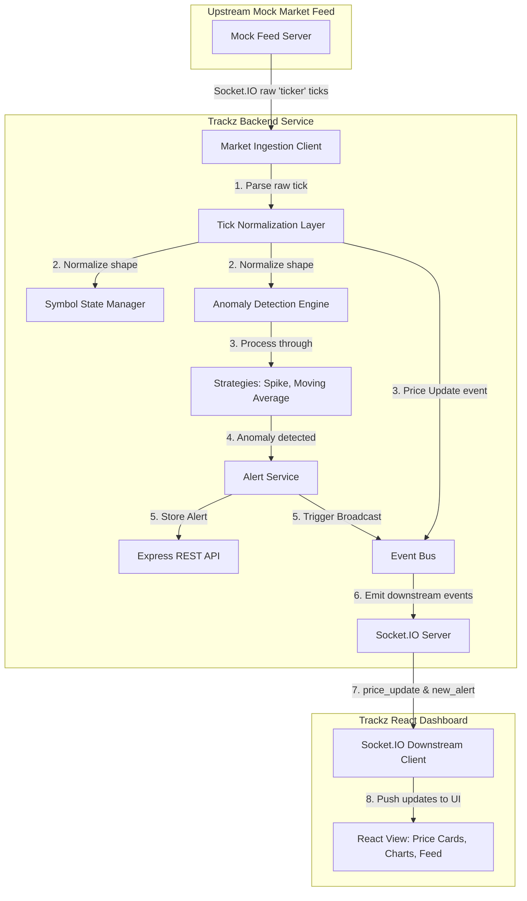

# Trackz Real-Time Anomaly Detection Platform


A premium, high-throughput, low-latency stock anomaly detection platform. Trackz ingests live mock market tick feeds (e.g., RELIANCE, TCS), normalizes and processes them in real-time through custom detection strategies, identifies sudden spikes or moving average deviations, and broadcasts alerts downstream to a React-based dashboard.

---

## ⚡ Highlights & Key Features


- **Ingestion Pipeline**: Asynchronous Socket.IO client that listens to an upstream mock market feed, normalizes incoming ticks, and tracks symbol states.
- **Dynamic Detection Engine**: Processes normalized ticks through a pluggable strategy pattern:
  - **Spike Strategy**: Monitors rolling price changes over a window (e.g., 30s) and flags movements exceeding a percentage threshold.
  - **Moving Average Deviation Strategy**: Compares current ticks against a sliding moving average of recent ticks and flags deviations.
- **Production-Hardened Security**:
  - **API Key Verification**: Restricts REST API endpoints to authorized clients via the `x-api-key` header.
  - **Global Rate Limiting**: Protects endpoints against denial-of-service attempts by limiting IPs to 100 requests/minute.
- **Replay-Burst Immunity**: Replaces real-world timers with simulated timestamps (`tick.TS`), eliminating false alerts during historical replays.
- **Polished React Dashboard**: High-fidelity dark UI featuring:
  - Live price tick cards with flash transitions matching price direction.
  - Interactive charts powered by `lightweight-charts` with single-series memory-leak prevention.
  - Real-time alert list with slide-in animations.
- **Simulation Tooling**: A robust `loadTest.js` script to simulate 1,000 virtual symbol streams and measure end-to-end processing latency.
- **Containerized Infrastructure**: Fully Dockerized backend and frontend services with a `docker-compose.yml` health-check workflow.

---

## 🏗️ System Architecture

The following Mermaid diagram visualizes the flow of stock tick data from the mock market feed, through the backend ingestion and detection engine, and down to the client dashboard.



---

## 📁 Repository Structure

```
tealvue/
├── docker-compose.yml       # Orchestrates the containers
├── loadTest.js              # Load testing script entry point
├── backend/
│   ├── Dockerfile           # Backend container build instructions
│   ├── package.json         # Backend Node dependencies & scripts
│   ├── loadTest.js          # Core load testing logic
│   └── src/
│       ├── app.js           # Express App configuration
│       ├── server.js        # HTTP Server & Socket.IO initialization
│       ├── config/          # Environment & strategy parameters
│       ├── detection/       # Anomaly engine & strategies
│       ├── middleware/      # Auth & rate-limiting middleware
│       ├── routes/          # API endpoint routes (/api/alerts, /api/symbols)
│       ├── services/        # Ingestion, normalizer, and alert services
│       ├── state/           # Thread-safe in-memory symbol tick storage
│       └── utils/           # Event bus, logger
├── frontend/
│   ├── Dockerfile           # Frontend build and Nginx deployment
│   ├── nginx.conf           # Custom Nginx configuration for routing
│   ├── package.json         # Frontend React dependencies & scripts
│   └── src/
│       ├── App.jsx          # Root component
│       ├── main.jsx         # App entry point
│       ├── index.css        # Base themes & layout styles
│       ├── App.css          # Premium glassmorphism UI styles
│       ├── components/      # Modular cards, charts, and header
│       ├── pages/           # Dashboard page layout
│       └── services/        # API client and socket subscriptions
```

---

## ⚙️ Environment Variables

### Backend (`backend/.env`)

| Variable | Description | Default |
| :--- | :--- | :--- |
| `PORT` | Local server port | `4000` |
| `API_KEY` | Key required for secure REST API endpoints | `trackz-assignment-key` |
| `FEED_URL` | Socket URL of the upstream mock market feed | `https://mock-data.tealvue.in` |
| `SYMBOLS` | Active symbols to track (comma-separated) | `RELIANCE,TCS` |
| `MAX_TICKS_PER_SYMBOL` | Buffer limit for tick state history | `500` |
| `MAX_ALERTS` | Buffer limit for cached alerts | `100` |

### Frontend (`frontend/.env`)

| Variable | Description | Default |
| :--- | :--- | :--- |
| `VITE_API_URL` | Base URL of the backend REST API | `http://localhost:4000` |
| `VITE_SOCKET_URL` | Downstream connection URL for Socket.IO | `http://localhost:4000` |
| `VITE_API_KEY` | Client-side API key for headers | `trackz-assignment-key` |

---

## 🚀 Getting Started

### Method A: Local Development

#### 1. Backend Service Setup
1. Navigate to the backend folder:
   ```bash
   cd backend
   ```
2. Install dependencies:
   ```bash
   npm install
   ```
3. Configure your environment. Verify that your `.env` contains the required keys (e.g. `API_KEY=trackz-assignment-key`).
4. Start the backend:
   ```bash
   npm start
   ```
   *For development with auto-reloads:* `npm run dev`

#### 2. Frontend Dashboard Setup
1. Navigate to the frontend folder:
   ```bash
   cd ../frontend
   ```
2. Install dependencies:
   ```bash
   npm install
   ```
3. Verify the `.env` configuration (e.g. `VITE_API_KEY=trackz-assignment-key`).
4. Launch the Vite local server:
   ```bash
   npm run dev
   ```
5. Open your browser to `http://localhost:5173`.

---

### Method B: Containerized Production (Docker Compose)

The easiest way to boot the complete environment (including all networking and environment variables) is via Docker Compose:

1. Build and boot all containers:
   ```bash
   docker compose up --build
   ```
2. The frontend web server is hosted on [http://localhost:5173](http://localhost:5173).
3. The backend API server is exposed on [http://localhost:4000](http://localhost:4000).

*To shut down the platform:* `docker compose down`

---

## 🧪 Testing

### 1. Automated Unit Tests
We have high-coverage unit tests verifying spike calculations, moving averages, and cooldown states:
```bash
cd backend
npm test
```

### 2. High-Throughput Load Testing
The platform contains a load testing runner to simulate intense trading volumes:
```bash
# From the root directory, execute:
node loadTest.js
```
#### How the Load Test Works:
1. Starts a local upstream Socket.IO mock server on port `4001`.
2. Connects a downstream client to the running backend at port `4000`.
3. Simulates **1,000 virtual symbols** (`RELIANCE-1` to `RELIANCE-500` and `TCS-1` to `TCS-500`).
4. Emits ticks globally (simulating 10 ticks every 50ms) with realistic simulated timestamp progression.
5. Intentionally spikes prices every 60 ticks per stream to trigger alerts.
6. Measures end-to-end processing latency (`emit` -> `backend detection` -> `alert broadcast` -> `receipt`).
7. Logs memory usage, throughput, and latencies, saving a summary to `loadtest_report.json`.

---

## 🛡️ Security Architecture

1. **REST Authentication**: The `/api/alerts` and `/api/symbols` endpoints are protected by the `authenticateApiKey` middleware. Requests must include the `x-api-key` header with the correct secret (or pass `?apiKey=<secret>` in queries).
2. **DoS Protection**: Express routes use `express-rate-limit` configured to limit each IP address to a maximum of **100 requests per minute**, returning standard HTTP `429 Too Many Requests` on violation.
3. **HTTP Header Hardening**: Secured using `helmet` to establish secure headers (e.g., Content-Security-Policy, Frame Options, XSS Protection).

---

## 🔄 Replay-Burst Solution

During historical feed replays, tick logs are pumped in microsecond intervals. Standard real-world clock comparisons fail because time is compressed. Trackz resolves this by:
- **Simulated Timestamps**: Using `tick.TS` for all window expiry (e.g., removing ticks older than `currentTS - 30s` in the Spike window).
- **Simulated Cooldowns**: Setting the last alert timestamp to `tick.TS` and validating that `(currentTS - lastAlertTS) >= cooldownDuration`.
This ensures that the detection algorithms remain fully deterministic and accurate, regardless of feed playback speed.

---

## 📌 Assumptions

1. **Upstream feed availability**: The mock feed server at `mock-data.tealvue.in` is reachable and emitting Socket.IO `ticker` events during evaluation.
2. **Price field mapping**: The upstream tick payload uses `CLOSE` as the last traded price field. The normalizer also supports `LTP`, `ATP`, and `price` as fallbacks in case the feed schema changes.
3. **Monotonic timestamps**: Simulated timestamps (`TS`) within each symbol stream are monotonically increasing. Out-of-order ticks are not explicitly handled.
4. **In-memory only**: The platform is designed for real-time monitoring; no persistent storage (database) is used. All tick buffers and alerts are held in-memory and reset on restart.
5. **Shared API key**: API key authentication is distributed via `.env` files for simplicity. A production deployment would use a proper secrets manager and JWT-based auth.
6. **Single-user dashboard**: The React frontend is a single-user monitoring console; no multi-tenant authentication layer is implemented.
7. **Feed protocol**: The upstream server expects a single `socket.emit('subscribe', [symbols])` call with an array payload (not individual emits per symbol).

---

## 📊 Replay-Burst Tick Counts

During live testing against the upstream mock feed server, the following tick volumes were observed:

| Source | Symbol | Approximate Rate | Volume (5 min session) |
|--------|--------|-----------------|----------------------|
| Live Feed | RELIANCE | ~5 ticks/sec | ~1,500 ticks |
| Live Feed | TCS | ~5 ticks/sec | ~1,500 ticks |
| Load Test | RELIANCE-1..500 | 100 ticks/sec (shared) | ~30,000 per stream |
| Load Test | TCS-1..500 | 100 ticks/sec (shared) | ~30,000 per stream |
| **Load Test Total** | **1,000 streams** | **200 ticks/sec** | **~60,000 ticks** |

During the live feed session shown in the dashboard screenshot, RELIANCE accumulated **252 ticks** in approximately 50 seconds of simulated market time. The tick data payload contains 18 fields per tick (`ID`, `SYMBOL`, `INSTRUMENT`, `LOTSIZE`, `TS`, `LTQ`, `ATP`, `TTQ`, `OPEN`, `HIGH`, `LOW`, `CLOSE`, `PREV_CLOSE`, `PREV_VOLUME`, `TURNOVER`, `PRICE_DIFF`, `VOLUME_DIFF`, `VWAP`).

---

## 🔮 With More Time I Would...

1. **Persistent Storage**: Integrate Redis or TimescaleDB for tick history and alert durability across server restarts.
2. **Bollinger Band Strategy**: Implement a third detection algorithm using rolling standard-deviation bands for more nuanced volatility detection.
3. **Hot Reload Config**: Use `chokidar` to watch `detectionConfig.js` for threshold changes at runtime without restarting the server.
4. **Multi-tenant Auth**: Replace the shared API key with JWT-based authentication and role-based access control for different user tiers.
5. **Horizontal Scaling**: Replace the in-process `EventEmitter` bus with Redis Pub/Sub so multiple backend instances can share state behind a load balancer.
6. **Alerting Integrations**: Add webhook, Slack, and email notification channels for critical anomalies.
7. **Historical Playback UI**: Build a timeline scrubber in the dashboard to replay and analyze past market sessions from stored tick data.
8. **End-to-End Tests**: Add integration tests covering the full pipeline from upstream feed ingestion through anomaly detection to dashboard rendering.
9. **Circuit Breaker**: Add a circuit breaker pattern on the upstream connection to gracefully degrade when the feed is unavailable.

---

## 🤝 Contribution Guidelines

1. Ensure all code passes ESLint and unit test checks before submitting pull requests.
2. Maintain clean separation of responsibilities: keep strategies stateless relative to individual ticks, leaving session management to the state engine.
3. Keep all responsive layouts adhering to the grid structure defined in `App.css`.

# teal01


