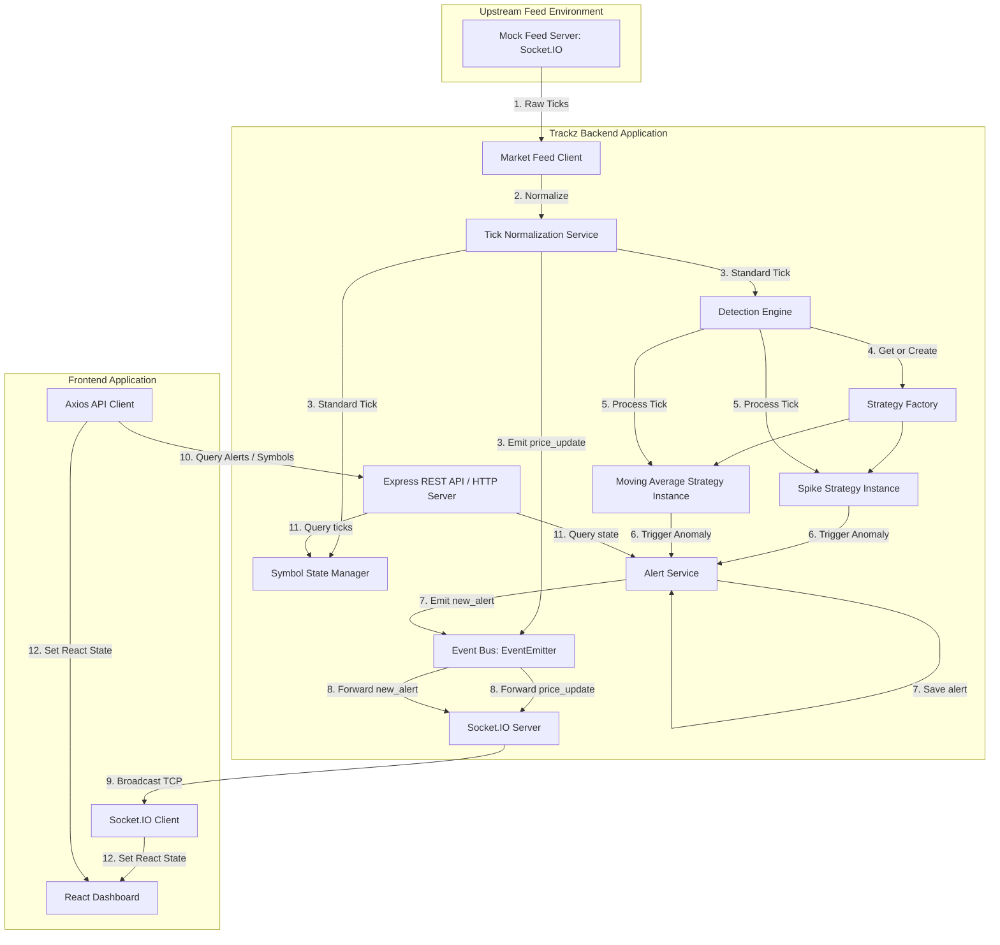
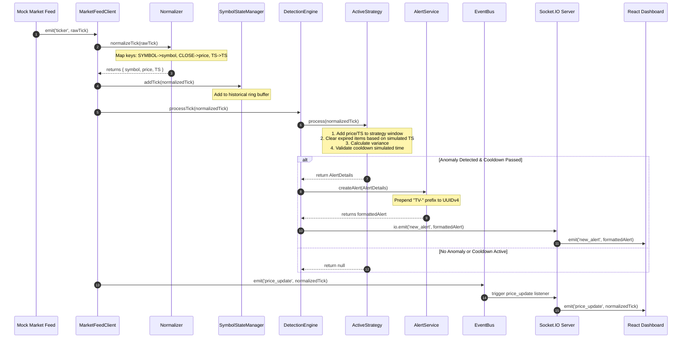

# Trackz Anomaly Detection Platform — Architecture Reference

This document provides a deep-dive analysis of the Trackz platform architecture, component relationships, data flow models, and design patterns.

---

## 🏗️ High-Level System Architecture

Trackz uses an event-driven, micro-service style decoupling between the ingestion layer, detection engine, alert pipeline, and client distribution layer. 

---

## 📦 Component Responsibilities

### 1. Ingestion Layer (`marketFeedClient.js`)
- **Role**: Establishes a persistent Socket.IO connection to the external mock feed server.
- **Resilience**: Configured with infinite reconnection attempts and backoff retry delays.
- **Trigger**: Receives `'ticker'` event packages and forwards them immediately to the normalizer.

### 2. Tick Normalization Service (`normalizer.js`)
- **Role**: Standardizes raw ticks from diverse upstream shapes.
- **Translation**:
  - Maps `SYMBOL` (or `symbol`) to uppercase `symbol`.
  - Extracts `CLOSE` (or `LTP`/`ATP`/`price`) as a float number `price`.
  - Extracts simulated time stamp `TS` (or `timestamp`) as `TS`, converting space-separated datetime strings to ISO 8601.
- **Additional fields**: Passes through `OPEN`, `HIGH`, `LOW`, `TTQ` (volume), `VWAP` for enriched downstream processing.
- **Validation**: Filters out packages missing prices, timestamps, or symbol strings.

### 3. Symbol State Manager (`symbolState.js`)
- **Role**: Manages an in-memory database of ticks per active symbol.
- **Memory Optimization**: Employs a fixed-size ring-buffer per symbol (default: max 500 ticks) to prevent memory leaks during prolonged sessions.
- **Query Support**: Supports the REST route with symbol statistics and active queues.

### 4. Detection Engine & Strategy Modules (`detection/`)
- **Role**: Evaluates individual ticks against mathematical detection models.
- **Dynamic Registration**: Allocates and saves independent strategy contexts for any active trading symbol (including virtual load test streams).
- **Spike Strategy**: Maintains a rolling historical queue of ticks inside a simulated timeframe window (e.g. 30s) and compares the oldest vs newest.
- **Moving Average Strategy**: Evaluates the current price against a sliding sample queue of ticks (e.g. 10 ticks) and determines percentage standard deviation.

### 5. Alert Service (`alertService.js`)
- **Role**: Registers and formats generated anomalies.
- **Formatting**: Assigns a unique, system-verifiable identifier prefixed with `TV-` (e.g., `TV-9b1deb4d-3b7d-4bad-9bdd-2b0d7b3dcb6d`).
- **Caching**: Limits total in-memory alerts to 100 entries.

### 6. Event Bus (`eventBus.js`)
- **Role**: Node.js `EventEmitter` singleton providing pub/sub architecture.
- **Purpose**: Fully decouples feed processing operations from downstream broadcast servers.

### 7. Socket.IO Broadcast Server (`server.js`)
- **Role**: Coordinates real-time streams to frontend dashboards.
- **Initial Handshake**: Pushes the latest 10 cached alerts to newly connected dashboards.
- **Real-Time Stream**: Listens to the `eventBus` for `price_update` and `new_alert` events, multiplexing them to all connected web clients.

---

## 🔄 Detailed Data Flow Sequences

### Sequence A: Ticker Ingestion & Anomaly Detection

---

## 🛠️ Design Patterns

### 1. Strategy Pattern
The platform implements a clean Strategy pattern for anomaly detection. All algorithms extend the `BaseStrategy` class:
- Defines abstract method `process(tick)`.
- Implements simulated cooldown verification (`checkCooldown`).
This makes it simple to plug in new algorithms (e.g., Bollinger Bands, Volume Spike detection) without modifying the ingestion pipelines.

### 2. Factory Pattern (`strategyFactory.js`)
Handles instant instantiation of strategic components based on configured type parameters (e.g. `'spike'` vs `'movingAverage'`). Decouples class implementations from configuration files.

### 3. Singleton Pattern
Core managers such as the `DetectionEngine`, `SymbolStateManager`, `AlertService`, and `eventBus` are implemented as classes and exported as initialized singletons. This guarantees single-source-of-truth states across concurrent modules.

### 4. Pub/Sub (Event Bus)
Utilizes the Node.js `EventEmitter` to publish data updates asynchronously. Helps prevent circular dependency errors between networking clients (`marketFeedClient.js`) and websocket servers (`server.js`).
